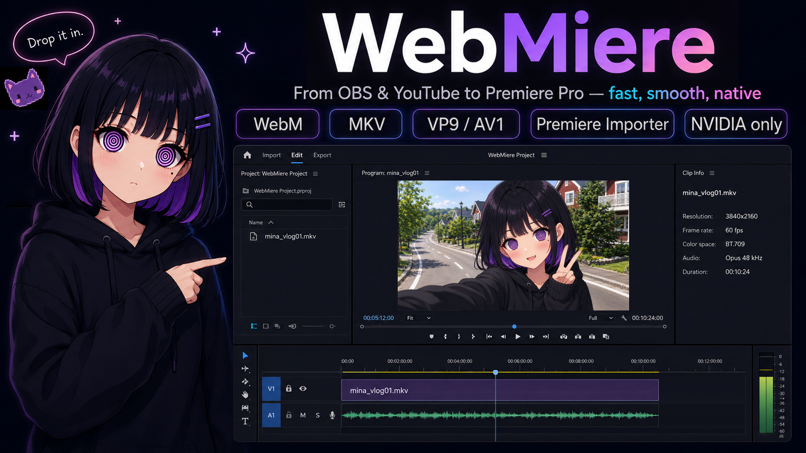

<p align="center">
  
</p>

# WebMiere

**Drop OBS recordings and YouTube-style WebM/MKV media straight into Adobe Premiere Pro.**

WebMiere is a native Windows x64 importer for supported OBS multi-track Matroska recordings and YouTube-style `.webm`/`.mkv` media, provided the files match its documented media requirements.

Import VP9 or AV1 video with up to six independent Opus stereo tracks, exposed separately in Premiere Pro.

**No ProRes transcode. No proxy prep. No WAV extraction.**

Import the file, drop it on the timeline, and start editing.

Demo: [Watch on YouTube](https://youtu.be/jyibSyATq1g)

If WebMiere saved you time, you can buy Mina a chocolate.

<a href="https://ko-fi.com/kawaiiengine">
  
</a>

## System Requirements
|  | VP9 | AV1 |
| :--- | :--- | :--- |
| **Platform** | Windows x64 / NVIDIA | Windows x64 / NVIDIA |
| **GPU** | **RTX 20 Series or Newer**<br><sub>Recommended</sub> | **RTX 30 Series or Newer**<br><sub>Required</sub> |
| **Host** | Adobe Premiere Pro 26.x | Adobe Premiere Pro 26.x |
| **Not Supported** | AMD-only, Intel-only, macOS | AMD-only, Intel-only, macOS |

WebMiere uses NVIDIA NVDEC, CUDA, and NPP, and prioritizes responsive timeline editing over broad format compatibility.

## Supported Media

| Feature | Specification |
| :--- | :--- |
| **Source** | Supported OBS recordings and YouTube-style WebM/MKV media |
| **Containers** | WebM / Matroska (`.webm`, `.mkv`) |
| **Video Streams** | Exactly one |
| **Video** | VP9 Profile 0 / AV1 Main SDR |
| **Pixel Format** | 8-bit YUV 4:2:0 |
| **Color** | SDR, BT.709 matrix, limited range |
| **Frame Rate** | Constant frame rate |
| **Maximum Dimensions** | 8192 × 4320 |
| **Audio Codec** | Opus |
| **Audio Streams** | None, or 1–6 independent streams |
| **Audio Format** | Stereo, 48 kHz per stream |
| **Premiere Output** | Separate stereo audio tracks |

Video-only files remain supported.

> **Not sure whether your file is compatible?**  
> [Check it with WebMiere Checker](https://kawaiiengine.github.io/WebMiere/checker/) — the check runs entirely in your browser, and nothing is uploaded.

## Download

[Download WebMiere-Setup.exe](https://github.com/KawaiiEngine/WebMiere/releases/latest/download/WebMiere-Setup.exe)

WebMiere is unsigned because the signing money went to chocolate.

If SmartScreen appears, select **More info** → **Run anyway**.

## OBS Multi-Track Recordings

WebMiere can import supported OBS Matroska recordings containing AV1 Main video and up to six independent Opus stereo audio tracks.

Each audio stream is exposed as a separate stereo track in Premiere Pro, in the same order in which it appears in the Matroska container.

Recommended OBS recording properties:

> **Note:** NVIDIA NVENC AV1 recording in OBS requires a GeForce RTX 40 Series GPU or newer.

- Output mode: Advanced
- Recording format: Matroska Video (`.mkv`)
- Video encoder: NVIDIA NVENC AV1
- Profile: Main
- Frame rate: Constant frame rate
- Color format: NV12 (8-bit, 4:2:0)
- Color space: Rec. 709
- Color range: Limited
- Audio encoder: FFmpeg Opus
- Sample rate: 48 kHz
- Channels: Stereo
- Enabled audio tracks: 1–6

Assign sources to recording tracks through OBS Advanced Audio Properties. For example:

- Track 1: complete mix
- Track 2: microphone
- Track 3: desktop or game audio
- Track 4: voice chat
- Track 5: music
- Track 6: auxiliary source

This is an example, not a required layout. Track contents are user-defined. WebMiere does not distribute an OBS profile or scene collection; this section provides setup guidance only.

## YouTube-Style Media and Frame Rate

WebMiere is designed for the ordinary CFR VP9 and AV1 SDR delivery streams commonly encountered in YouTube-style media.

In the media tested so far, YouTube delivery streams have been CFR. True VFR remains outside this plugin's scope.

## Validation

- Six-track routing and long-duration synchronization were verified against direct FFmpeg decoding using an approximately 15-minute recording and a recording longer than three hours.
- No measurable audio drift was observed in the tested recordings.
- Existing single-track AV1 SDR/Opus editing and export behavior was also revalidated.

## Unsupported Media

- True variable-frame-rate video
- VP9 or AV1 10-bit or 12-bit video
- VP9 or AV1 4:2:2, 4:4:4, RGB, or alpha
- HDR, BT.2020, PQ, or HLG media, including AV1 HDR media
- Full-range video
- H.264, HEVC, ProRes, and other non-VP9/non-AV1 video codecs
- More than one video stream
- More than six audio streams
- AAC, Vorbis, and other audio codecs besides Opus
- Mixed audio sample rates or channel counts, or any sample rate other than 48 kHz
- Mono, surround, or other multichannel audio
- Audio streams with different start times

Unsupported files containing multiple audio streams are rejected as a whole rather than partially imported.

## Installation

1. Install or update the NVIDIA graphics driver.
2. Close Adobe Premiere Pro.
3. Launch `WebMiere-Setup.exe`.
4. If Microsoft Defender SmartScreen displays **“Windows protected your PC”**:
   1. Select **More info**.
   2. Confirm that the app is `WebMiere-Setup.exe`.
   3. Select **Run anyway**.
5. Choose **Install**.
6. When Windows asks for permission, allow the WebMiere Worker installer to make changes.
7. Start Premiere Pro.

Default installation path:

```text
C:\Program Files\Adobe\Common\Plug-ins\7.0\MediaCore\WebMiere
```

The installed WebMiere directory must contain `WebMiere.prm` and the matching `ffmpeg` and `nvidia` runtime subdirectories supplied with that release. Do not mix FFmpeg, CUDA, or NPP files from different WebMiere builds.

A typical installed directory contains:

```text
WebMiere.prm
assets\
  WebMiere-App.ico
  licenses\
    ARTWORK_POLICY.md
    README.md
    WebMiere-MPL-2.0.txt
    FFmpeg-COPYING.LGPLv3.txt
    FFmpeg-COPYING.GPLv3.txt
    FFmpeg-THIRD-PARTY-NOTICES.txt
    README-FFmpeg.txt
    SHA256SUMS-FFmpeg.txt
    dav1d-COPYING.BSD-2-Clause.txt
    nv-codec-headers-MIT.txt
    NVIDIA-CUDA-Toolkit-12.9-EULA.txt
    Microsoft-Visual-Cpp-Redistributable.txt
    THIRD_PARTY_NOTICES.md
    source\
      FFmpeg-WebMiere-8.1.2-4-Corresponding-Source.zip
ffmpeg\
  avcodec-62.dll
  avformat-62.dll
  avutil-60.dll
  swscale-9.dll
  swresample-6.dll
nvidia\
  cudart64_12.dll
  nppc64_12.dll
  nppicc64_12.dll
  nppidei64_12.dll
  nppig64_12.dll
```

Driver-provided NVIDIA components such as `nvcuda.dll` are not bundled with WebMiere.

Standard Inno Setup logs are written to the Windows temporary directory. These are installer logs, not WebMiere importer runtime logs.

### Uninstall

1. Close Premiere Pro.
2. Launch `WebMiere-Setup.exe` and choose `Uninstall`, or uninstall WebMiere from Windows Apps / Installed apps.
3. Restart Premiere Pro.

## Distribution and Third-Party Source Compliance

Official prebuilt binaries and the installer are distributed through the official WebMiere GitHub Releases unless KawaiiEngine expressly designates another authorized channel.

Source files under `src/` are licensed under the Mozilla Public License 2.0. The corresponding source for each official binary release is identified by its release tag or source archive. The installer, artwork, characters, logos, branding, and other materials are not licensed under the MPL unless expressly stated.

The FFmpeg runtime used by WebMiere is built from pinned source revisions. The Official Package includes the corresponding source archive in `assets\licenses\source`, with related build, configuration, license, checksum, diff, and provenance records included under `assets\licenses`.

Third-party license texts and notices applicable to the distributed binaries are included with the official binary package.

Review `THIRD_PARTY_NOTICES.md` and the licenses of the exact runtime DLLs. Third-party licenses do not grant rights to the WebMiere installer or its brand assets. Rights in the source files under `src/` are governed separately by the MPL-2.0.

## Troubleshooting

### WebMiere Does Not Appear in Premiere

- Confirm that the system has a supported NVIDIA GPU.
- Install a compatible NVIDIA graphics driver.
- Confirm that `WebMiere.prm`, `ffmpeg`, and `nvidia` are present in the same `WebMiere` directory.
- Confirm that the FFmpeg DLLs are in `WebMiere\ffmpeg` and the CUDA/NPP DLLs are in `WebMiere\nvidia`.
- Install the Microsoft Visual C++ 2015-2022 Redistributable for x64.
- Fully restart Premiere Pro.
- Check the Windows temporary directory for the standard Inno Setup installer log if installation failed.
- Check Premiere's plugin loading log or use Process Monitor to identify a missing DLL if installation succeeded but the importer does not load.

WebMiere links directly against the NVIDIA driver API; runtime DLLs are preloaded at importer startup. If a required DLL is missing, WebMiere safely refuses to initialize.

### A File Does Not Import

A `.webm` or `.mkv` extension does not guarantee compatibility. Compare the file against these requirements:

- **Codec:** VP9 Profile 0 or AV1 Main SDR
- **Frame rate:** Constant frame rate rather than true VFR
- **Video streams:** Exactly one
- **Pixel format:** 8-bit YUV 4:2:0
- **Color:** SDR, BT.709 matrix, limited range
- **AV1 hardware:** For normal AV1 use, the system has an NVIDIA GPU with AV1 hardware decode support
- **Audio:** Video-only, or one to six independent Opus stereo streams at 48 kHz
- **Audio timing:** All enabled audio streams use the same format and begin at the same source time
- **File integrity:** Fully downloaded and not truncated

For systems without NVIDIA AV1 hardware decode support, use VP9/Opus media instead of AV1/Opus.

If another importer is installed, WebMiere is designed to take supported VP9/Opus and AV1 SDR/Opus media and pass unsupported media back to Premiere so another importer can handle it.

If a YouTube download that should be supported does not import, download it again before investigating further. Incomplete downloads and unusual remuxing tools can produce files outside the normal supported YouTube-style VP9/Opus or AV1 SDR/Opus shape.

## Known Behavior and Design Choices

- WebMiere favors responsive editing over strict recovery. Short audio reads and some recoverable audio decode gaps may be padded with silence.
- Audio timing is normalized relative to the shared source start time. Small startup residues are handled at the beginning of each stream rather than allowed to become progressive audio drift.
- YouTube/DASH muxing may produce small differences between video and audio end times. When a stream-specific duration is unavailable, a container-duration fallback can result in a short final-frame hold. This has not shown a visible problem in normal tested YouTube material.
- True VFR files may be accepted as nominal CFR without exact timestamp reconstruction; frames may be selected, repeated, or skipped without a warning.
- Premiere may occasionally request BGRA output for thumbnails, isolated frames, effects, or internal display paths. This is expected; normal playback generally uses YUV420P when available.

## License

Copyright (c) 2026 KawaiiEngine (Sashimiso).

Source files under `src/` are licensed under the Mozilla Public License 2.0. See [LICENSE](LICENSE).

Official prebuilt binaries and the installer are distributed under separate terms. Those terms do not limit the rights granted under the MPL-2.0 to the source files under `src/`.

The installer, artwork, characters, logos, branding, and other materials are not licensed under the MPL unless expressly stated.

Third-party components remain under their respective licenses and are summarized in `THIRD_PARTY_NOTICES.md`.

## Artwork and Characters

Mina, Miere, the WebMiere logo, icons, installer artwork, and promotional images are proprietary brand and character assets. The WebMiere end-user license does not grant a right to extract, redistribute, commercialize, or train AI models on those assets.

Non-commercial fan art is welcome.

See [ARTWORK_POLICY.md](ARTWORK_POLICY.md) for details.
